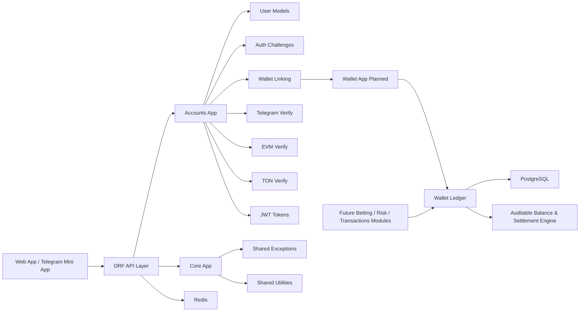

# RyoLand

<div align="center">

  
  
  
  
  

</div>

RyoLand is a high-performance Web3 and Telegram-based online gaming and betting platform built with Django. The platform is designed around secure identity verification, wallet-aware authentication, reliable accounting, and modular service architecture that can scale into a full gaming ecosystem.

This codebase currently implements the foundation layer for user identity and blockchain verification, including Telegram login, EVM wallet signing, TON proof verification, and JWT-protected API access. The project is intentionally aligned with strong domain principles so the future wallet, ledger, betting, and settlement systems are built on a safe and auditable foundation.

---

## Overview

RyoLand combines:

- Telegram Mini App and Telegram widget authentication
- EVM wallet identity verification using `personal_sign`
- TON Connect-style proof validation
- Django REST Framework APIs
- JWT authentication
- modular app-based backend architecture
- a future-ready financial ledger model for gaming operations

The system is designed for operational clarity, idempotent state transitions, and a disciplined double-entry financial model instead of ad hoc balance mutation.

---

## Core Guiding Principles

### 1. Money as a double-entry ledger
Every monetary action is modeled as a ledger event rather than a direct balance mutation. This enforces:

- traceability for every credit and debit,
- easier reconciliation and audits,
- safer handling of balances, payouts, and bonuses,
- financial correctness for wagering and settlement systems.

### 2. Idempotent operations
User actions must be safe to retry without creating duplicate effects. This is crucial for:

- login and challenge flows,
- wallet linking and unlinking,
- settlement and ledger writes,
- any API request that may be retried over a fragile network or client state.

### 3. Decoupled app architecture
The project is structured with separate Django apps that isolate responsibilities and simplify scaling. This avoids monolithic logic and makes subsequent modules easier to evolve independently.

### 4. Strict state machines
User, wallet, and transactional states are treated as controlled business states rather than loosely-managed fields. The platform enforces explicit transitions for:

- account lifecycle states,
- wallet link lifecycle,
- challenge validity windows,
- verification outcomes,
- future betting and settlement events.

---

## Tech Stack

- Python
- Django
- Django REST Framework
- PostgreSQL
- Redis
- JWT (`djangorestframework-simplejwt`)
- Web3 / EVM wallet verification
- TON Connect / TON proof validation
- PyNaCl cryptography
- SQLite for local development and tests

### Key dependencies

- `django`
- `djangorestframework`
- `djangorestframework-simplejwt`
- `eth-account`
- `pytoniq-core`
- `PyNaCl`
- `psycopg` / PostgreSQL driver
- `redis`

---

## Architecture Diagram



This layered architecture keeps identity, wallet logic, and future gaming/financial modules separated and easier to validate independently.

---

## Project Structure

```text
GameSection/
├── apps/
│   ├── __init__.py
│   ├── core/
│   │   ├── __init__.py
│   │   ├── exceptions.py
│   │   └── ...
│   ├── accounts/
│   │   ├── __init__.py
│   │   ├── admin.py
│   │   ├── apps.py
│   │   ├── exceptions.py
│   │   ├── models.py
│   │   ├── serializers.py
│   │   ├── services.py
│   │   ├── tests.py
│   │   ├── urls.py
│   │   ├── verifiers.py
│   │   └── views.py
│   ├── wallet/                  # Planned
│   │   └── ...
│   ├── ledger/                  # Planned
│   │   └── ...
│   ├── betting/                 # Planned
│   │   └── ...
│   ├── transactions/            # Planned
│   │   └── ...
│   ├── risk/                    # Planned
│   │   └── ...
│   └── rewards/                 # Planned
│       └── ...
├── config/
│   ├── __init__.py
│   ├── settings.py
│   ├── urls.py
│   └── wsgi.py
├── manage.py
├── requirements.txt
├── requirements-dev.txt
├── .gitignore
├── db.sqlite3
├── README.md
└── .env/                       # local environment virtual environment
```

### Implemented today

- `apps.accounts`
  - user model and auth challenge logic
  - Telegram login verification
  - EVM and TON verification helpers
  - serializers and services for auth flows
  - unit tests for auth foundations

- `apps.core`
  - shared domain exceptions and reusable logic

---

## Current Status & Roadmap

### ✅ Step 1: Core Foundation & Web3/Telegram Authentication (Completed)

This phase is complete and validated.

Completed features:

- standard Django project bootstrap and app structure
- custom user account model
- Telegram auth verification flow
- EVM signature verification flow
- TON proof verification flow
- service-layer auth and challenge orchestration
- DRF serializers and response handling
- JWT-based authentication support
- test suite covering the core behavior

Verification status:

- `python manage.py check` → passed
- `python manage.py test` → 40 tests passing, 1 skipped

### ⏳ Step 2: Wallet & Double-Entry Ledger System (In Progress)

The next milestone is the core financial layer:

- wallet account abstraction
- balance accounting via double-entry ledger
- immutable transaction posting
- ledger-based settlement workflows
- robust wallet link and unlink safeguards
- integration points for betting and rewards flows

### Future roadmap

- wallet and custody management
- transaction reconciliation and auditing
- betting engine foundations
- risk and anti-fraud checks
- admin tooling and reporting
- production deployment hardening

---

## Getting Started

### Prerequisites

- Python 3.10+
- PostgreSQL (recommended for production parity)
- Redis (recommended for future caching and queue usage)
- Git

### 1. Clone the repository

```bash
git clone https://github.com/Corawl13/RyoLand.git
cd GameSection
```

### 2. Create a virtual environment

```bash
python -m venv .venv
source .venv/bin/activate
```

On Windows PowerShell:

```powershell
py -m venv .venv
.\.venv\Scripts\Activate.ps1
```

### 3. Install dependencies

```bash
pip install --upgrade pip
pip install -r requirements.txt
pip install -r requirements-dev.txt
```

### 4. Set environment variables

Create local environment variables before running Django commands.

Example:

```bash
export DJANGO_SECRET_KEY="change-me"
export DJANGO_DEBUG="1"
export DJANGO_ALLOWED_HOSTS="localhost,127.0.0.1"
export POSTGRES_DB="ryoland"
export POSTGRES_USER="postgres"
export POSTGRES_PASSWORD="postgres"
export POSTGRES_HOST="localhost"
export POSTGRES_PORT="5432"
export TELEGRAM_BOT_TOKEN="123456:TEST-TOKEN"
export WEB3_AUTH_DOMAINS="localhost:3000,app.example.com"
export WEB3_AUTH_URI="https://app.example.com"
```

Windows PowerShell:

```powershell
$env:DJANGO_SECRET_KEY="change-me"
$env:DJANGO_DEBUG="1"
$env:DJANGO_ALLOWED_HOSTS="localhost,127.0.0.1"
$env:POSTGRES_DB="ryoland"
$env:POSTGRES_USER="postgres"
$env:POSTGRES_PASSWORD="postgres"
$env:POSTGRES_HOST="localhost"
$env:POSTGRES_PORT="5432"
$env:TELEGRAM_BOT_TOKEN="123456:TEST-TOKEN"
$env:WEB3_AUTH_DOMAINS="localhost:3000,app.example.com"
$env:WEB3_AUTH_URI="https://app.example.com"
```

### 5. Run migrations

```bash
python manage.py migrate
```

### 6. Start the development server

```bash
python manage.py runserver
```

### 7. Run the test suite

```bash
python manage.py test
```

---

## Development Principles

This project intentionally prioritizes:

- security and cryptographic verification,
- explicit state transitions,
- audit-friendly accounting practices,
- modular backend growth,
- business logic in service layers rather than scattered handlers,
- test-first validation for new features.

---

## Contributing

Contributions are welcome as long as they preserve the platform’s architecture and financial safety rules.

Priorities for contributors:

- keep domain logic in services and models,
- keep auth and accounting flows idempotent,
- avoid silent balance mutation,
- add tests for new behaviors,
- keep app boundaries clean and explicit.

---

## License

This project is currently intended for internal and project-specific use. Add an explicit public license before broader distribution or commercial deployment.

---

## Summary

RyoLand is being built as a durable, secure, modular Web3 gaming platform. The current implementation establishes the identity and verification foundation required to evolve into a broader betting and gaming product. The next step is the wallet and ledger layer, which will provide the financial integrity needed to support real-money operations safely and auditable.
