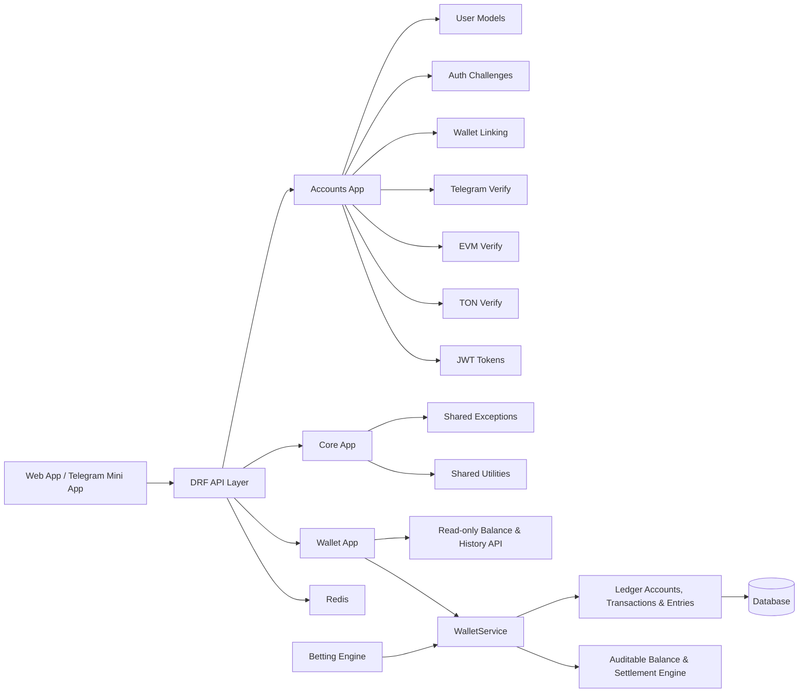

# RyoLand

<div align="center">

  
  
  
  
  

</div>

RyoLand is a high-performance Web3 and Telegram-based online gaming and betting platform built with Django. The platform is designed around secure identity verification, wallet-aware authentication, reliable accounting, and modular service architecture that can scale into a full gaming ecosystem.

This codebase implements user identity and blockchain verification, including Telegram login, EVM wallet signing, TON proof verification, and JWT-protected API access, alongside a wallet, append-only double-entry ledger, betting engine, and outcome settlement and payouts.

---

## Overview

RyoLand combines:

- Telegram Mini App and Telegram widget authentication
- EVM wallet identity verification using `personal_sign`
- TON Connect-style proof validation
- Django REST Framework APIs
- JWT authentication
- modular app-based backend architecture
- an append-only double-entry wallet ledger for financial operations

The system is designed for operational clarity, idempotent state transitions, and a disciplined double-entry financial model instead of ad hoc balance mutation.

---

## Core Guiding Principles

### 1. Money as a double-entry ledger
Every monetary action is modeled as a ledger event rather than a direct balance mutation. This enforces:

- traceability for every credit and debit,
- easier reconciliation and audits,
- safer handling of balances, payouts, and bonuses,
- financial correctness for wagering and settlement systems.

### 2. Idempotent operations
User actions must be safe to retry without creating duplicate effects. This is crucial for:

- login and challenge flows,
- wallet linking and unlinking,
- settlement and ledger writes,
- any API request that may be retried over a fragile network or client state.

### 3. Decoupled app architecture
The project is structured with separate Django apps that isolate responsibilities and simplify scaling. This avoids monolithic logic and makes subsequent modules easier to evolve independently.

### 4. Strict state machines
User, wallet, and transactional states are treated as controlled business states rather than loosely-managed fields. The platform enforces explicit transitions for:

- account lifecycle states,
- wallet link lifecycle,
- challenge validity windows,
- verification outcomes,
- future betting and settlement events.

---

## Tech Stack

- Python
- Django
- Django REST Framework
- PostgreSQL
- Redis
- JWT (`djangorestframework-simplejwt`)
- Web3 / EVM wallet verification
- TON Connect / TON proof validation
- PyNaCl cryptography
- SQLite for local development and tests

### Key dependencies

- `django`
- `djangorestframework`
- `djangorestframework-simplejwt`
- `eth-account`
- `pytoniq-core`
- `PyNaCl`
- `psycopg` / PostgreSQL driver
- `redis`

---

## Architecture Diagram



This layered architecture keeps identity, wallet logic, and future gaming modules separated and independently testable.

---

## Project Structure

```text
GameSection/
├── apps/
│   ├── __init__.py
│   ├── core/
│   │   ├── __init__.py
│   │   ├── exceptions.py
│   │   └── ...
│   ├── accounts/
│   │   ├── __init__.py
│   │   ├── admin.py
│   │   ├── apps.py
│   │   ├── exceptions.py
│   │   ├── models.py
│   │   ├── serializers.py
│   │   ├── services.py
│   │   ├── tests.py
│   │   ├── urls.py
│   │   ├── verifiers.py
│   │   └── views.py
│   ├── wallet/
│   │   ├── __init__.py
│   │   ├── admin.py
│   │   ├── apps.py
│   │   ├── exceptions.py
│   │   ├── migrations/
│   │   │   └── 0001_initial.py
│   │   ├── models.py
│   │   ├── serializers.py
│   │   ├── services.py
│   │   ├── tests.py
│   │   ├── urls.py
│   │   └── views.py
│   ├── betting/                 # Implemented in Step 3
│   │   ├── migrations/
│   │   ├── models.py
│   │   ├── services.py
│   │   ├── tests.py
│   │   └── ...
│   ├── settlement/              # Implemented in Step 4
│   │   ├── migrations/
│   │   ├── models.py
│   │   ├── services.py
│   │   ├── tests.py
│   │   └── ...
│   ├── transactions/            # Planned
│   │   └── ...
│   ├── risk/                    # Planned
│   │   └── ...
│   └── rewards/                 # Planned
│       └── ...
├── config/
│   ├── __init__.py
│   ├── settings.py
│   ├── urls.py
│   └── wsgi.py
├── manage.py
├── requirements.txt
├── requirements-dev.txt
├── .gitignore
├── db.sqlite3
├── README.md
└── .env/                       # local environment virtual environment
```

### Implemented today

- `apps.accounts`
  - user model and auth challenge logic
  - Telegram login verification
  - EVM and TON verification helpers
  - serializers and services for auth flows
  - unit tests for auth foundations

- `apps.core`
  - shared domain exceptions and reusable logic

- `apps.wallet`
  - multi-asset wallets and append-only double-entry ledger
  - atomic wallet services with idempotency and balance locking
  - read-only balance and paginated transaction-history APIs
  - read-only Django admin for wallets and ledger records

- `apps.betting`
  - event, market, selection, bet, and bet-selection schema
  - single and combo bet placement with immutable `locked_odds` snapshots
  - relative odds drift tolerance and combo market validation via `InvalidComboError`
  - double-layered idempotency across bet placement and wallet reservation
  - ledger links through `reservation_transaction` and `settlement_transaction`

- `apps.settlement`
  - two-phase event settlement with independent per-bet transactions and idempotent retries
  - multi-currency batch payout totals recorded in `payout_totals` JSON
  - `PENDING/WON/LOST/VOID` selection outcome tracking
  - single and combo bet payout calculation, including voided combo legs
  - staff-only API and Django admin result submission, settlement triggering, and batch audit history

---

## Current Status & Roadmap

### ✅ Step 1 & 1b: Core Foundation, Web3 & Telegram Auth (Completed)

This phase is complete and validated.

Completed features:

- standard Django project bootstrap and app structure
- custom user account model
- Telegram auth verification flow
- EVM signature verification flow
- TON proof verification flow
- service-layer auth and challenge orchestration
- DRF serializers and response handling
- JWT-based authentication support
- test suite covering the core behavior

Verification status:

- `python manage.py check` → passed
- `python manage.py test apps.accounts apps.core` → 77 tests discovered (76 passed, 1 skipped)

### ✅ Step 2: Wallet & Double-Entry Ledger System (`apps.wallet`) (Completed)

Step 2 adds the platform's auditable financial layer:

- **Append-only double-entry ledger:** `LedgerTransaction`, `LedgerEntry`, and `LedgerAccount` record balanced, zero-sum transactions. Debit and credit behavior follows one consistent account-balance rule.
- **Multi-asset support:** Wallets support USDT, TON, Telegram Stars (`STARS`), and bonus credits (`BONUS`).
- **Balance locking:** `available_balance` and `locked_balance` distinguish spendable funds from amounts reserved for active bets and pending purchases. Withdrawals debit available funds atomically.
- **Pessimistic locking and idempotency:** Wallet writes use `select_for_update()` and idempotency keys to prevent double-spending and duplicate postings. PostgreSQL is the intended backend for row-level locking.
- **Telegram Fragment readiness:** Ledger transaction types support Stars, Premium, and NFT purchases through `PURCHASE_TG_STARS`, `PURCHASE_TG_PREMIUM`, and `PURCHASE_NFT`.
- **Read-only API:** `GET /api/v1/wallet/balances/` returns balance breakdowns; `GET /api/v1/wallet/transactions/` returns paginated transaction history with filters.

Verification status:

- `python manage.py check` → passed
- `python manage.py test` → 106 tests discovered (105 passed, 1 skipped)

### ✅ Step 3: Betting Engine & Odds Verification (`apps.betting`) (Completed)

Step 3 adds event and market cataloging, odds verification, and atomic single/combo bet placement:

- **Betting schema:** `SportEvent`, `Market`, and `Selection`, plus `Bet` and `BetSelection` tickets.
- **Single and combo bets:** Combo odds are multiplied across distinct markets; invalid combinations raise `InvalidComboError`.
- **Immutable odds snapshots:** The current database odds are stored as `locked_odds` at placement, independent of later price changes.
- **Relative odds drift tolerance:** Submitted odds are accepted within a configurable relative tolerance, then the current database odds are locked.
- **Double-layered idempotency:** Bet placement and the underlying wallet reservation each use idempotency keys to prevent duplicate tickets or stake movement.
- **Ledger traceability:** Bets link to the reserve ledger entry through `reservation_transaction`; `settlement_transaction` is ready for Step 4.
- **Concurrency coverage:** Concurrent idempotent replays and competing stake reservations pass against PostgreSQL row locking.

Verification status:

- `python manage.py check` → passed
- `python manage.py test` → 134 tests discovered on local PostgreSQL; 133 passed, 1 skipped, 0 failures, and 0 errors.
- `test_concurrent_bets_cannot_overdraw_the_wallet` → passed on PostgreSQL.

### ✅ Step 4: Outcome Settlement & Payout Engine (`apps.settlement`) (Completed)

Step 4 resolves official event results, settles bet legs, and releases or pays reserved stakes through the double-entry wallet ledger:

- **Two-phase transaction design:** Event and market resolution commits separately from per-bet settlement; each bet is isolated in its own transaction so concurrent workers can process different bets without holding one event-wide transaction.
- **Multi-currency payout tracking:** Settlement batches aggregate payout amounts by currency in the `payout_totals` JSON field.
- **Selection outcomes:** Markets resolve selections to `PENDING`, `WON`, `LOST`, or `VOID`.
- **Single and combo settlement:** Winning odds are applied to single/combo stakes; a lost combo leg loses the ticket, void legs contribute neutral odds, and a fully void ticket is refunded.
- **Operator workflows:** Staff can enter event results in Django admin, trigger settlement for selected events, and review batch status, errors, and payout totals. The staff-only API also supports result submission and batch history.

Verification status:

- `python manage.py check` → passed
- `python manage.py test` → 155 tests discovered on PostgreSQL; 154 passed, 1 optional TON test skipped, 0 failures, and 0 errors.
- Four-worker concurrent settlement test → passed on PostgreSQL.

---

## Getting Started

### Prerequisites

- Python 3.10+
- PostgreSQL (recommended for production parity)
- Redis (recommended for future caching and queue usage)
- Git

### 1. Clone the repository

```bash
git clone https://github.com/Corawl13/RyoLand.git
cd GameSection
```

### 2. Create a virtual environment

```bash
python -m venv .venv
source .venv/bin/activate
```

On Windows PowerShell:

```powershell
py -m venv .venv
.\.venv\Scripts\Activate.ps1
```

### 3. Install dependencies

```bash
pip install --upgrade pip
pip install -r requirements.txt
pip install -r requirements-dev.txt
```

### 4. Set environment variables

Create local environment variables before running Django commands.

Example:

```bash
export DJANGO_SECRET_KEY="change-me"
export DJANGO_DEBUG="1"
export DJANGO_ALLOWED_HOSTS="localhost,127.0.0.1"
export POSTGRES_DB="ryoland"
export POSTGRES_USER="postgres"
export POSTGRES_PASSWORD="postgres"
export POSTGRES_HOST="localhost"
export POSTGRES_PORT="5432"
export TELEGRAM_BOT_TOKEN="123456:TEST-TOKEN"
export WEB3_AUTH_DOMAINS="localhost:3000,app.example.com"
export WEB3_AUTH_URI="https://app.example.com"
```

Windows PowerShell:

```powershell
$env:DJANGO_SECRET_KEY="change-me"
$env:DJANGO_DEBUG="1"
$env:DJANGO_ALLOWED_HOSTS="localhost,127.0.0.1"
$env:POSTGRES_DB="ryoland"
$env:POSTGRES_USER="postgres"
$env:POSTGRES_PASSWORD="postgres"
$env:POSTGRES_HOST="localhost"
$env:POSTGRES_PORT="5432"
$env:TELEGRAM_BOT_TOKEN="123456:TEST-TOKEN"
$env:WEB3_AUTH_DOMAINS="localhost:3000,app.example.com"
$env:WEB3_AUTH_URI="https://app.example.com"
```

### 5. Run migrations

```bash
python manage.py migrate
```

### 6. Start the development server

```bash
python manage.py runserver
```

### 7. Run the test suite

```bash
python manage.py test
```

---

## Development Principles

This project intentionally prioritizes:

- security and cryptographic verification,
- explicit state transitions,
- audit-friendly accounting practices,
- modular backend growth,
- business logic in service layers rather than scattered handlers,
- test-first validation for new features.

---

## Contributing

Contributions are welcome as long as they preserve the platform’s architecture and financial safety rules.

Priorities for contributors:

- keep domain logic in services and models,
- keep auth and accounting flows idempotent,
- avoid silent balance mutation,
- add tests for new behaviors,
- keep app boundaries clean and explicit.

---

## License

This project is currently intended for internal and project-specific use. Add an explicit public license before broader distribution or commercial deployment.

---

## Summary

RyoLand is a secure, modular Web3 gaming platform with identity verification, an auditable wallet ledger, betting with odds verification, and an outcome settlement and payout engine.
